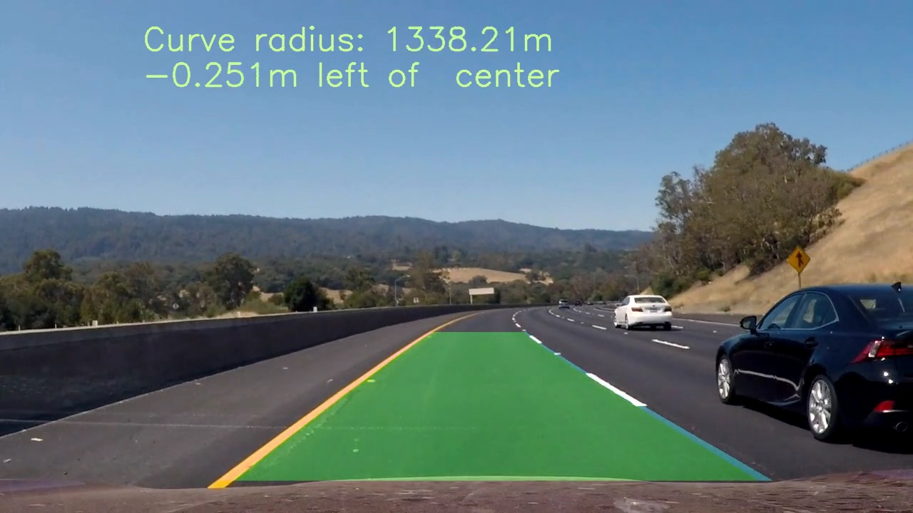
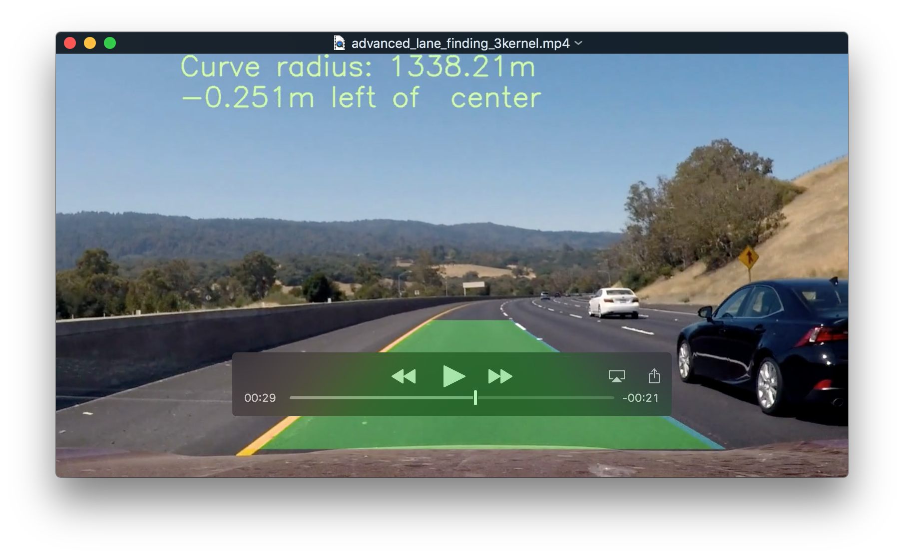
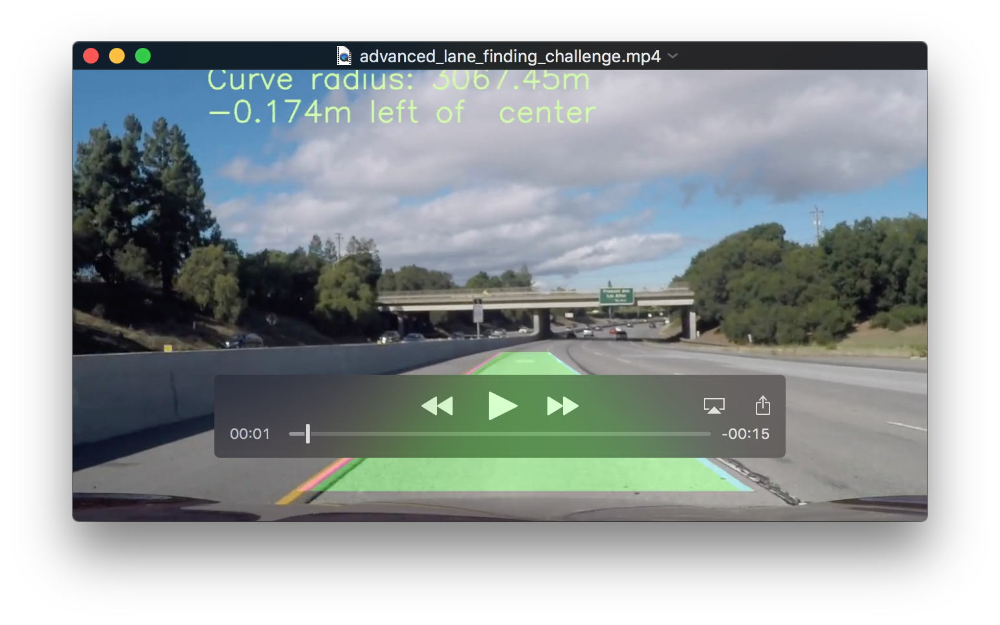

# Advanced Lane Finding Project

[](http://www.udacity.com/drive)

Overview
---
This repository contains my submission for the Advanced Lane Finding Project, which is part of the curriculum for term 1 of the Udacity Self-Driving Car Engineer Nanodegree Program. The goal of this project is to write a software pipeline to identify the lane boundaries in a video from a front-facing camera on a car.

The steps of this project are the following:

* Compute the camera calibration matrix and distortion coefficients given a set of chessboard images.
* Apply a distortion correction to raw images.
* Use color transforms, gradients, etc., to create a thresholded binary image.
* Apply a perspective transform to rectify binary image ("birds-eye view").
* Detect lane pixels and fit to find the lane boundary.
* Determine the curvature of the lane and vehicle position with respect to center.
* Warp the detected lane boundaries back onto the original image.
* Output visual display of the lane boundaries and numerical estimation of lane curvature and vehicle position.

[//]: # (Image References)

[image1]: ./visualization/calibration_visualization.jpg "Calibration chessboard"
[image2]: ./visualization/undistort_visualization.jpg "Distortion correction"
[image3]: ./visualization/perspective_transform_visualization.jpg "Perspective transform"
[image4]: ./visualization/masked_warped_oldcolor_only.jpg "Masked and warped using color only"
[image5]: ./visualization/masked_warped_oldcolor_and_gradient.jpg "Masked and warped using old color and gradients"
[image6]: ./visualization/masked_warped_gradient_only.jpg "Masked and warped using gradient only"
[image7]: ./visualization/masked_warped_best_color.jpg "Masked and warped using best color"
[image8]: ./visualization/showcompletepipeline_oldcolor_only.jpg "Complete pipeline using color only"
[image9]: ./visualization/showcompletepipeline_oldcolor_andgradient.jpg "Complete pipeline using color and gradient" 
[image10]: ./visualization/showcompletepipeline_gradient_only.jpg "Complete pipeline using gradient only"
[image11]: ./visualization/showcompletepipeline_best_color.jpg "Complete pipeline using best color approach"
[image12]: ./visualization/search_windows1.jpg "Search windows1"
[image13]: ./visualization/search_windows2.jpg "Search windows2"
[image14]: ./visualization/histogramtest1.jpg "Histogram1"
[image15]: ./visualization/histogramtest2.jpg "Histogram 2"
[image16]: ./visualization/straight_lines2.jpg "Straight lines 2"
[image17]: ./visualization/perspective_transform_straightline_visualization.jpg "Straight line 2 transformed"
[image18]: ./visualization/perspective_transform_straightline_visualization.jpg "Straight line 2 transformed"

### Files Submitted
My project includes the following files:
* [proj4.py](./proj4.py) -- contains the script to create and train the model
* [advanced_lane_finding_3kernel.mp4](./advanced_lane_finding_3kernel.mp4) -- video showing my output for the input video called project_video.mp4
* [advanced_lane_findingchallenge.mp4](./advanced_lane_finding_harder_challenge.mp4) -- video showing my output for the input video called challenge_video.mp4 

These videos can be executed by running the following command:
```sh
python proj4.py
```
The arguments that can be passed to proj4.py are as follows:

| Argument Name     | Description                                  | Default         | 
|:-----------------:|:--------------------------------------------:|:---------------:| 
| diagnostics (d)     | Whether verbose diagnostics are written to the video             | False            |
| visualization (v) | Figures but not videos              | False           | 

The following is an example of a command line that can be used just to visualize the data. 
```sh
python proj4.py --visualization=true
```
When data is visualized, jpg images of the plots are both shown on the screen and written to the following directory: ./visualization. This directory must be created manually before running the script.

## Compute the Camera Calibration Matrix and Distortion Coefficients

I computed the camera calibration matrix and distortion coefficients using the 20 images that were provided for us in the [./camera_cal](./camera_cal) directory. Of these 20 images only 17 had the specified 9x6 pattern that we were told to use, but this was more than enough to compute the necessary calibration matrix. The chessboard corners for 3 of the 17 good images are shown below. You can see that the chessboard corners are accurately detected in all cases.
![alt text][image1]
## Apply Distortion Correction
I tested the generated calibration matrix and distortion coefficients on an image that I felt would be most likely to highlight the effect of the distortion correction. This image is shown below. Note that the effect of the distortion correction is very subtle. But if you look closely at the white car in the original image on the left and compare it to the image on the right, which uses the distortion correction, you can see that the car looks more bulbous in the image on the left. You can also see the difference by looking at the bottom of the image where you can see the hood of the car in which the camera is mounted. The hood has a slightly different shape in the image on the right. In general the effects of the distortion correction are most pronounced at the edges of the image. The corrected image also has a narrower field of view. Less of the white car on the right and less of the tree closest to the camera are visible in the right image.
![alt text][image2]
## Apply a perspective transform
I next did a perspective transformation. I used one of the straight road images and selected 4 points on lane lines that would form a rectangle when you were looking straight down but form a quadrilateral in the original image. I used the straight road image, which is shown directly below. 
![alt text][image16]
The points I came up with are shown below. The array called "src" are the 4 points in the original image "dst" are the points that these map to 
```python
src = np.array([[(529, 466), (751, 466),
                       (1218, 675), (62, 675)]], dtype=np.float32)
dst = np.array([[(139, 0), (1141, 0),
                       (1141, 720), (139, 720)]], dtype=np.float32)
```

When the transformation is applied to the original, straight-line image shown above, we get the result shown below. Notice that the result is very close to perfect. The lane lines are parallel and the image does appear as though one is looking directly down at the road.
![alt text][image17]
I created a set of 7 images that included both a subset of the test images that were provided for us as well as some problematic frames from the first challenge video. Running the perspective transform on these images yields the result shown directly below. In looking closely at the images, I did notice that images that were taken from the first (non challenge) video are all perfect, they give the illusion that one is looking straight down at the road. However, the transformation did not work as well for the images that came from the challenge video. If you look carefully at the first, fifth, sixth, and seventh images below, you can see that they give the impression that we are looking at the videos at a slight angle instead of straight down. In looking carefully at the original videos (the ones on the left) I believe that the camera was mounted slightly higher when the challenge video was shot.
![alt text][image3]
## Create a Thresholded Binary Image
The next step was to create a thresholded, binary image. I started out following the steps shown in class. I applied a combination of Sobel gradients and color thresholds and spent a great deal of time tuning the gradients and color thresholds. I ultimately came to the conclusion that the y gradient and the direction gradient were of limited utility. Eventually I wound up "or-ing" the x gradient with the magnitude gradient. I used a threshold of (25-255) on both. For color detection I used the B channel in the LAB colorspace to detect yellow and the L channel from the LUV colorspace to detect white. I used a threshold of 220<L<=255 on the L channel and 55<B<=200 on the B channel. This combination worked quite well on the required video, but did not work that well on the challenge videos.  
![alt text][image5]
Keep in mind with these images that many of them were deliberately chosen because they are the worse frame in the video from which they are from. Notice that the last image was taken in the shadows of an overpass. I checked out the Slack channel and a number of people were claiming that it was better to just use color thresholding and eschew the Sobel gradients. I also Googled to find some other gradient/thresholding solutions. The one that was the most different from mine was implemented by [Jeremy Shannon](https://github.com/jeremy-shannon/CarND-Advanced-Lane-Lines). I implemented his algorithm in the apply_thresholds2 method of [proj4.py](./proj4.py). He used color thresholding only, leveraging the L and B channels as described above. But he applied a "smart" threshold on the B channel to better isolate yellow. He only scaled the B channel if the max value on the b_channel was greater than 175. This yielded the result shown below, which indeed was better than my solution. It was nearly perfect when the video was generated on the easier challenge video, but did not yield a good solution on the harder challenge video either
![alt text][image7]
The result using this approach was not perfect. Notice that the left (yellow) line is not visible in the last 3 images. Keep in mind that these last 3 images were chosen precisely because they were problematic, so I didn't expect them to work all the time. 
## Detect Lane Pixels and Find the Lane Boundary
The lane lines were found using a method in proj4.py called get_left_and_right_lane_fits. In this method I start by looking at the bottom half of the image and divided the image into three segments along the x axis. The left and right lane lines are assumed to be in the first and last of these segments respectively, with the middle third being the area between the lines. The project description recommended splitting the x axis in half, but I found that this caused my logic to occasionally detect a lane line in an adjacent lane. I first take a histogram along all the columns in the lower half of the image. I then find the maximum of the histogram in the first and last thirds of the x axis. These are the beginnings of the left and right lines respectively. The histogram looks as shown below. 
![alt text][image14]
I use the detected line beginnings as a starting point from which to search for the lines. I use a sliding window, placed around the line centers, to find and follow the lines up to the top of the frame. I find the line by searching for all of the non-zero pixels within each window. I then use the numpy polyfit function to fit a second order polynomial to the nonzero points. A fit is done starting in the first third of the x axis to find the left line and the last third to find the right line.  A visualization of this process is shown below.
![alt text][image12]
I use global instances of a Line class to track the history of the left and right line. I keep a running average of the last 5 sets of polynomial fit coefficients. This allows me to draw a line on the image even if I am unable to find one of the lines for a particular frame. Additionally once we have found the line using the histogram method described above, we can first search for the line within a margin around where the previous line. The get_left_and_right_lane_lines_from_previous_fit method contains my implementation of this algorithm.
## Sanity Check
I implemented a sanity check algorithm on the found curve fit. If the curve fit fails the sanity check, I set the detected flag on the global line instance for the missing line to false and "invalidate" the last found curve fit by removing it from my track of the most recent 5. If I had found this invalid fit using the previous fit method defined above, then I go back and restart the process of identifying the base of the line using a histogram. I fail the sanity check if any of the following conditions are met:
1. The number of pixels between the x intercept of the left and right lines is less than 200 or greater than 800
2. The absolute value of the ratio of the right curvature over the left curvature is greater than 8 and the avg curvature is less than 3000
I added diagnostics and observed the failure mode when I got a bad curve fit and most of the times a symptom of a bad fit is that the left and right curvatures were wildly different from each other.
## Determine the Curvature of the Lane and Vehicle Position with Respect to Center
I calculated the curvature of the lane using the following equation. 
```python
((1 + (2*fit[0]*y*ym_per_pix + fit[1])**2)**1.5) / np.absolute(2*fit[0])
```

Where fit is the 3 coefficients for our second order polynomial curve fit for the lane line. Y is the point at which the curvature is calculated and ym_per_pix is the number of meters per pixel in the y dimension. 
I calculated the vehicle position within the lane by calculating the minimum x coordinate of the left line in the bottom 20 pixels of the image and then the maximum x coordinate of the right line in the bottom of the 20 pixels. The average of these 2 points is the center of the lane in the image. I then get the distance in pixels of the center of the lane to the actual center of the image, which should be the center of the car. Once I convert this pixel distance into meters using the conversion of pixels to meters which is 3.7 / 700, we now have the distance of the center of the car from the lane center. If this value is positive the car is positioned to the right of center, if it is negative, then the car is to the left of center. 
The following image shows the complete pipeline run for the test image set that I previously identified.
![alt text][image11]
## Results
My final results look good on the required video. 
[](./advanced_lane_finding_3kernel.mp4) 
On the challenge video, it's fair. The lanes are correct most of the time, but there are some places, such as under the bridge where the lines are lost. I would love to have been able to spend more time on the project, but working full time that was not possible. See this video below. To generate this video I used the color thresholding algorithm from Jeremy Shannon.
[](./advanced_lane_finding_challenge.mp4) 
My logic did not work well on the harder challenge, so I did not include the results here, but I would like to work more on it later.
## To Blur Or Not To Blur
I did investigate whether adding a slight gaussian blur would improve the situation. Interestingly I found out that the results of applying a blur vary. On the required video, it did not make much of a difference. The video shown above was generated using a gaussian blur with a kernel size of 3. However, on the challenge video it made a significant difference. I used a kernel size of 5 to generate the video shown above and using a kernel size of 3 or no blur at all actually made the behavior on this video worse. I believe that is the case because there is less contrast (because of the lighter road surface) and more variation in lighting conditions in the challenge video.
## Conclusions
Overall my approach worked well, but I believe there is more work required to get something to work across a wide range of road surface and lighting conditions. In particular, the behavior of the thresholding used to detect color and gradients needs to be improved. Perhaps a range of values can be tried and then the "right" answer chosen by seeing which is most likely a match to the real world using sanity checking. Also, although I didn't implement this because of lack of time. I did notice that you can tell if your fit has generated a wavy line instead of a smooth curve by calculating the curvature at multiple points on the line and validate that it varies only within a small tolerance. 

